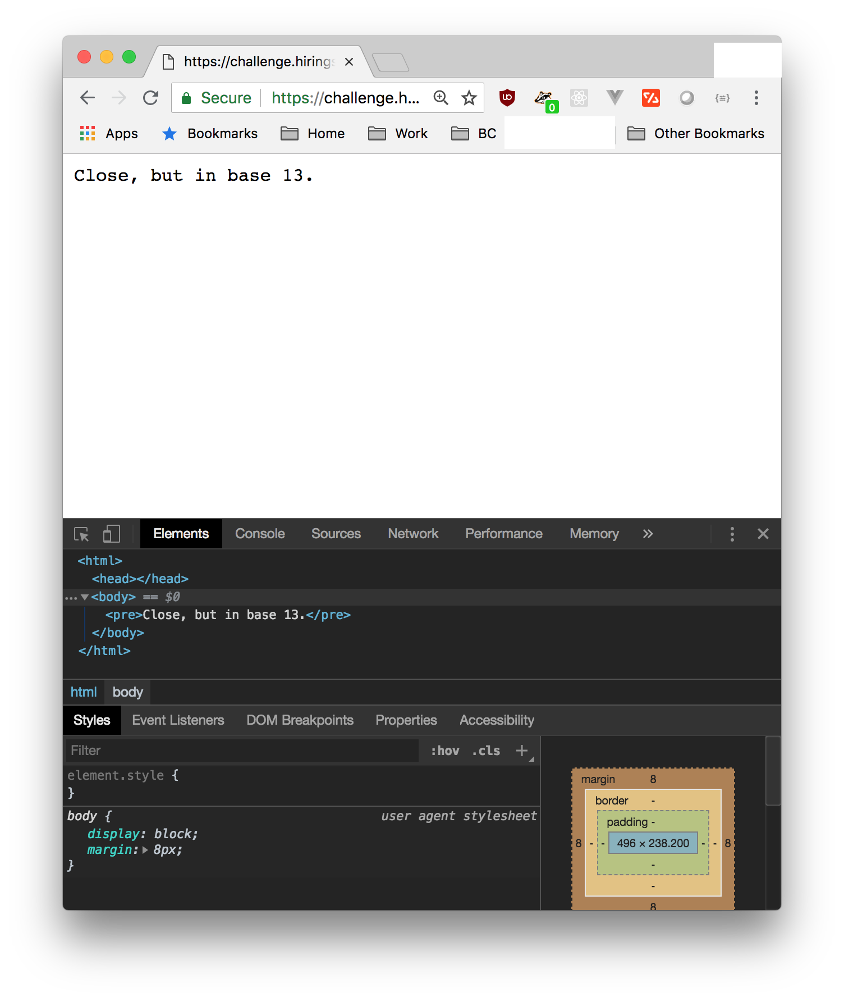
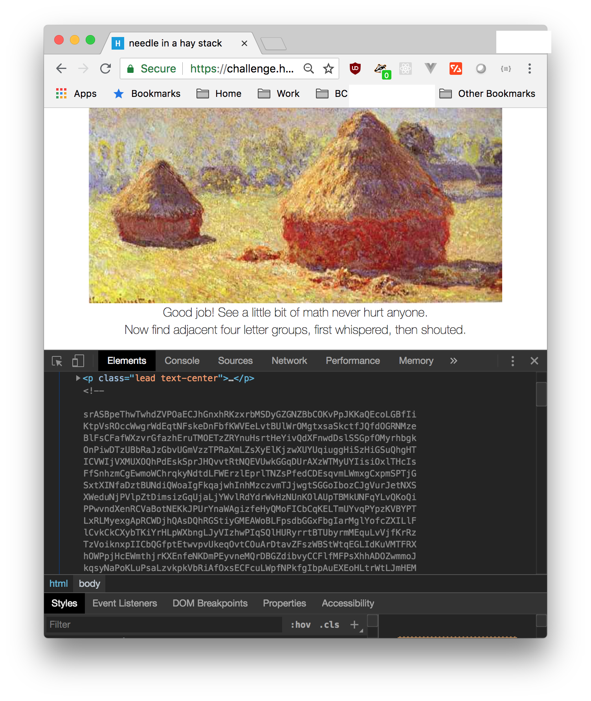
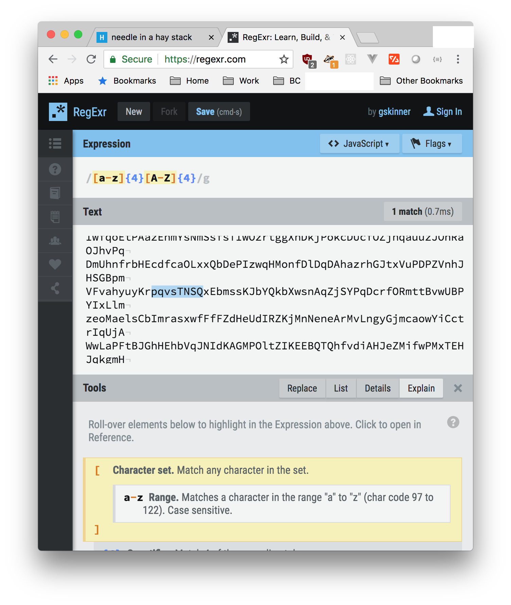
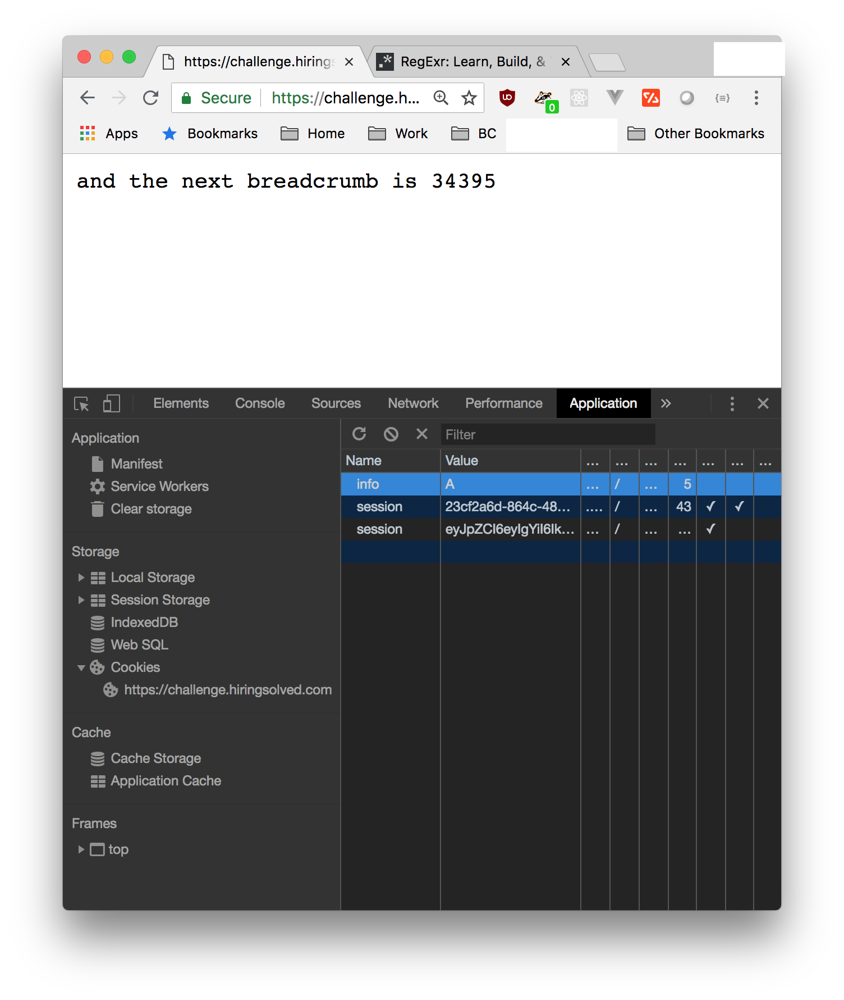
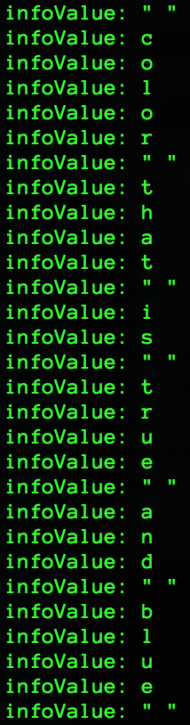
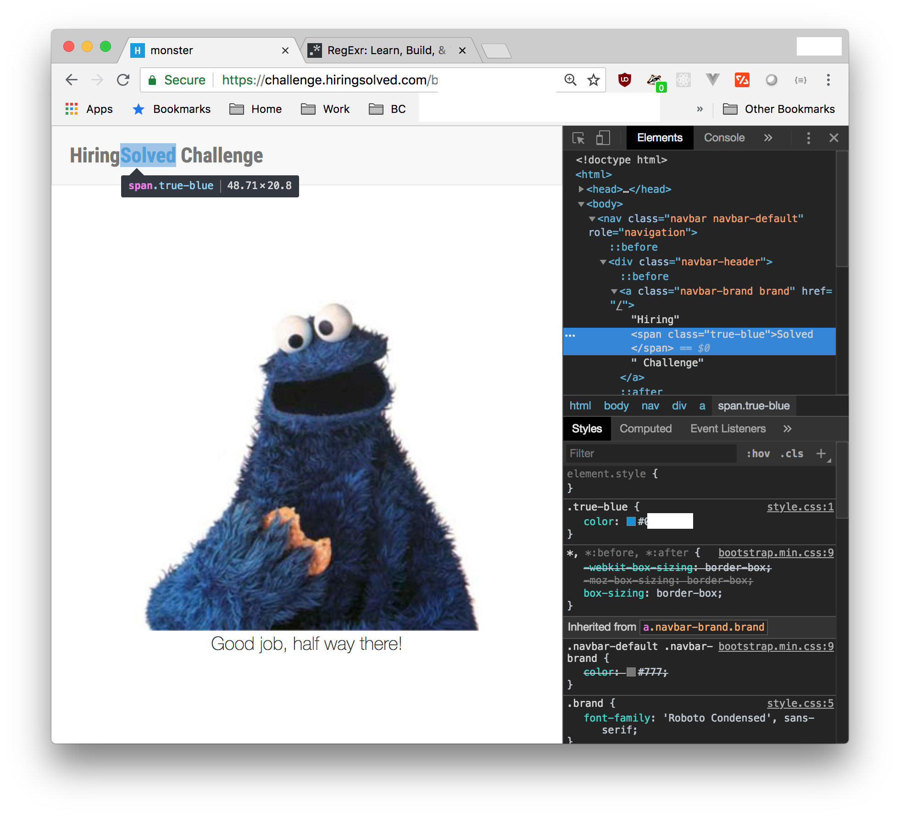

# I highly recommend that you solve this yourself!

### Move along if you've finished the challenge and want to compare approaches or if you just dislike the satisfaction of solving something yourself!

## .
## .
## .
## .
## .
## .
## .
## .
## .
## .
## .
## .
## .
## .


# 0) Go to [challenge.hiringsolved.com](https://challenge.hiringsolved.com/)


# 1a) Enter 54 as URL path


# 1b) 52^10 = 42^13
* 54 / 13 = 4 remainder 2 
* 4  / 13 = 0 remainder 4


# 2) Look in the DOM to find the "haystack"


# 3) Use Regex to pattern match four lowercase letters followed by four upper


# 4) Each breadcrumb page will have an "info" cookie.


# 5a) You can replace the URL path with the breadcrumb number >50 times but here's the script that I wrote to print out the cookie values in my terminal...
```javascript
const request = require("request");
const urlPackage = require("url");

makeRequestToUrlWithNewBreadcrumb(process.argv[2]);

function makeRequestToUrlWithNewBreadcrumb(crumb) {
  const url = `https://challenge.hiringsolved.com/breadcrumbs/${crumb}`;
  request(url, (err, response, body) => {
    const match = body.match(/\d+/g);
    if (match) {
      const num = match.map(Number);
      const breadcrumb = num[num.length - 1];
      if (breadcrumb) {
        printCookieInfo(url);
        if (String(breadcrumb).length === 5) {
          makeRequestToUrlWithNewBreadcrumb(breadcrumb);
        } else {
          const q = urlPackage.parse(url, true);
          const splat = q.path.split("/");
          const newBreadcrumb = Number(splat[splat.length - 1]) + 42;
          makeRequestToUrlWithNewBreadcrumb(newBreadcrumb);
        }
      }
    } else {
      console.log(body);
    }
  });
}

function printCookieInfo(url) {
  const jar = request.jar();
  let infoValue = "";
  request({ url, jar }, response => {
    const cookie_string = jar.getCookieString(url);
    info = cookie_string.split(";").find(a => a.includes("info"));
    if (info) {
      const infoSplat = info.split("=");
      console.log("infoValue:", infoSplat[infoSplat.length - 1]);
    }
  });
}
```
# 5b) They change the breadcrumb values occasionally that make these shoddy if/else rules worthless. Write a more robust script if you want but I have no incentive to put more time or effort into this.

# 5c) End result URL path is still the same, but I have omitted the URL upon request...

# 6a) Note this riddle printed out in the previous step (below)...


# 6b) Look through DOM and find **true-blue** class. Insert hex value as url path.


# 7) Send POST request setting "**hiring=true**" in addition to name and email headers. Phone and Twitter are optional.


# 8) Get "thanks for playing" message.


# 9) They'll never respond but I commend them for putting together such a fun puzzle!